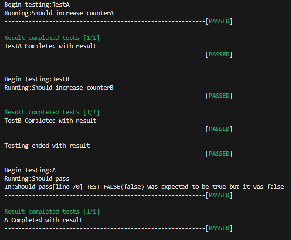

# Bitter
Single Header Testing Framework



Just drop it inside your project and you're ready to go.
Easy to use and implement, useful on small projects when you don't want dependency to huge testing frameworks.
They already many exists single header testing framework, but this is my own, and it's similar to how unreal engine implements automation testing.

# Logging to a file
When launching the executable you can pass a filename that will be used a log (the path must exist)
`~ test.exe testResult.txt`

# Usage

With macros
```cpp
// Test class definition
// example file: myclass.test.cpp

  TEST_DEFINE_CLASS(MyTestClass) // Class name must be unique
          int RandomNumberAboveZero();
          int MyVariable{};
  TEST_END_CLASS(MyTestClass)

  void MyTestClass::Define()
  {
      //Define our test cases
      TestCase("MyVariable should not be zero", [this]() {
          MyVariable = RandomNumberAboveZero();
          TEST_NEQUAL(0, MyVariable);
      }
  }

// example file: main.test.cpp
  #include "bitter.h"
  int main(int argc, char* argv[])
  {
      RUN_ALL_TESTS(argc, argv);
  };
```

Without macros
```cpp
// Test class definition
// example file: myclass.test.cpp
  class MyTestClass final : public bitter::AutomatedTestInstance {
     public:
          virtual void Define() override;
     protected:
          int RandomNumberAboveZero();
          int MyVariable{};
  };

  //Register class statically or add it manually in the main.test.cpp but not both
  static bitter::TestInserter<MyTestClass> RegisterMyTestClass("MyTestClass");

  void MyTestClass::Define()
  {
      //Define our test cases
      TestCase("MyVariable should not be zero", [this]() {
          MyVariable = RandomNumberAboveZero();
          TEST_NEQUAL(0, MyVariable);
      }
  }

// example file: main.test.cpp

  #include "foxtest.h"

  int main(int argc, char* argv[]) {
     bitter::AutomationTester engineTester;
     engineTester.AddTest<MyTestClass>("MyTestClass");
     engineTester.AddTest<MyOtherTestClass>("MyOtherTestClass");

     return engineTester.RunAllTests(argc, argv);
 };
```


